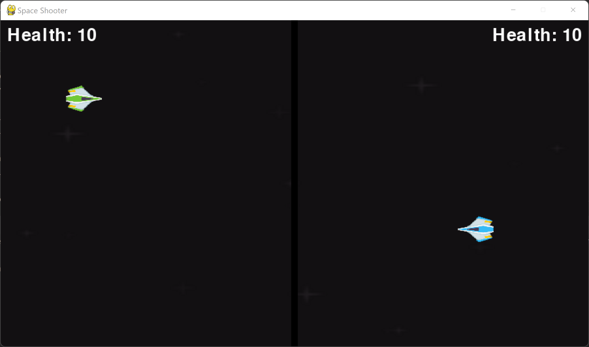
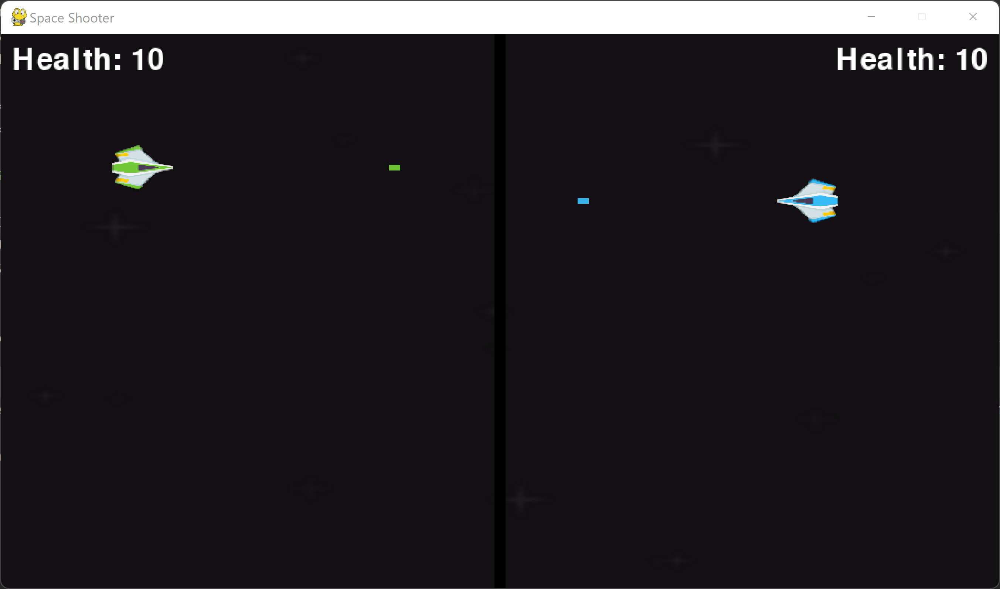
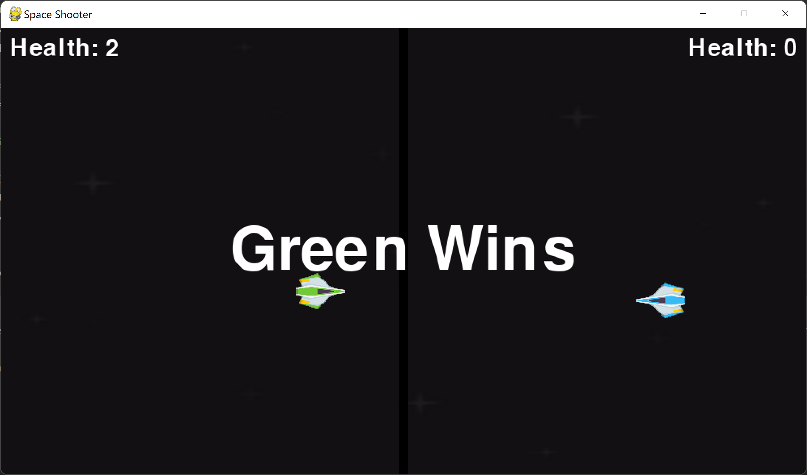

# Space Shooter

> **Language**: Python
> 
> **Developer**: Brendan Sadlier

This is a space shooter game developed in python using the PyGame library

[Assets used are from Kenny’s Space Shooter Redux Pack](https://www.kenney.nl/assets/space-shooter-redux)

### Game Screenshots

